<h3> ❤❤❤❤❤❤❤❤❤❤❤❤❤❤❤❤❤❤❤❤❤❤❤ </h3>

<h1>Architecture du projet </h1>

<h1>La partie 1 </h1>

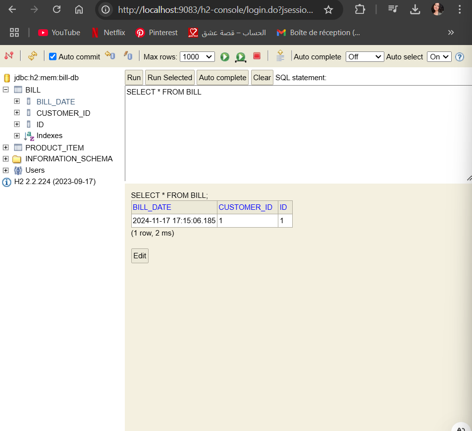
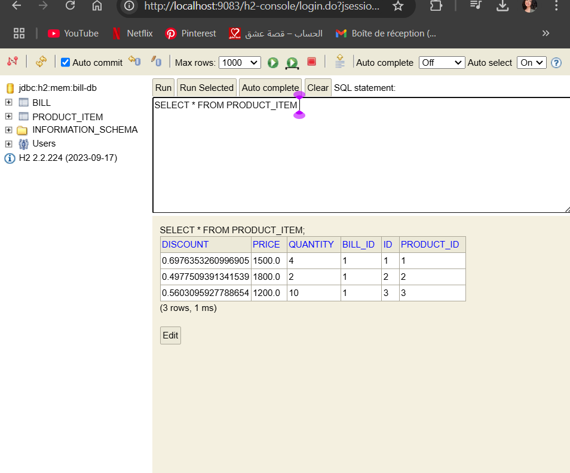
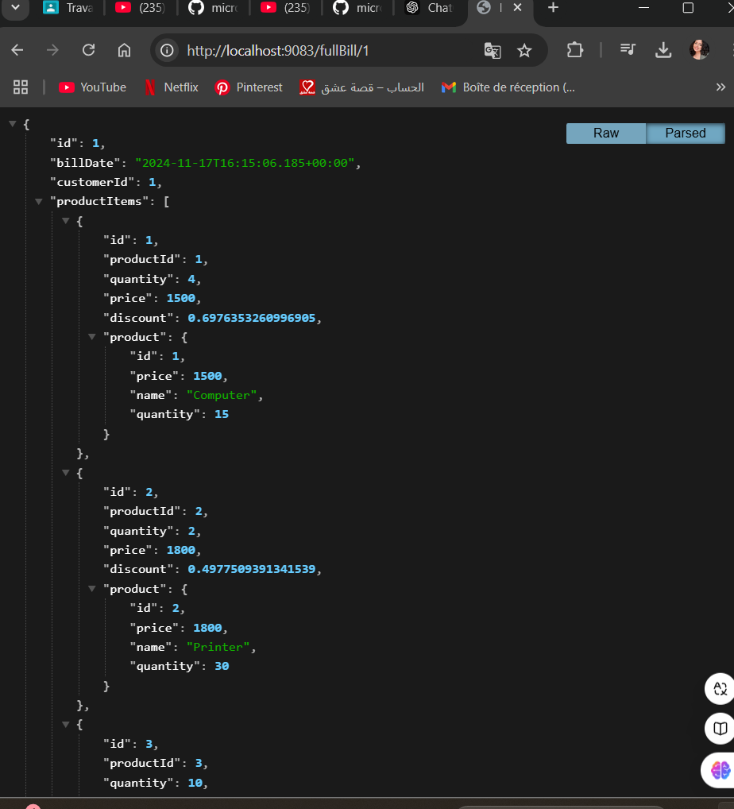

<h1>La partie 2</h1>
 <h3> Graphql</h3>
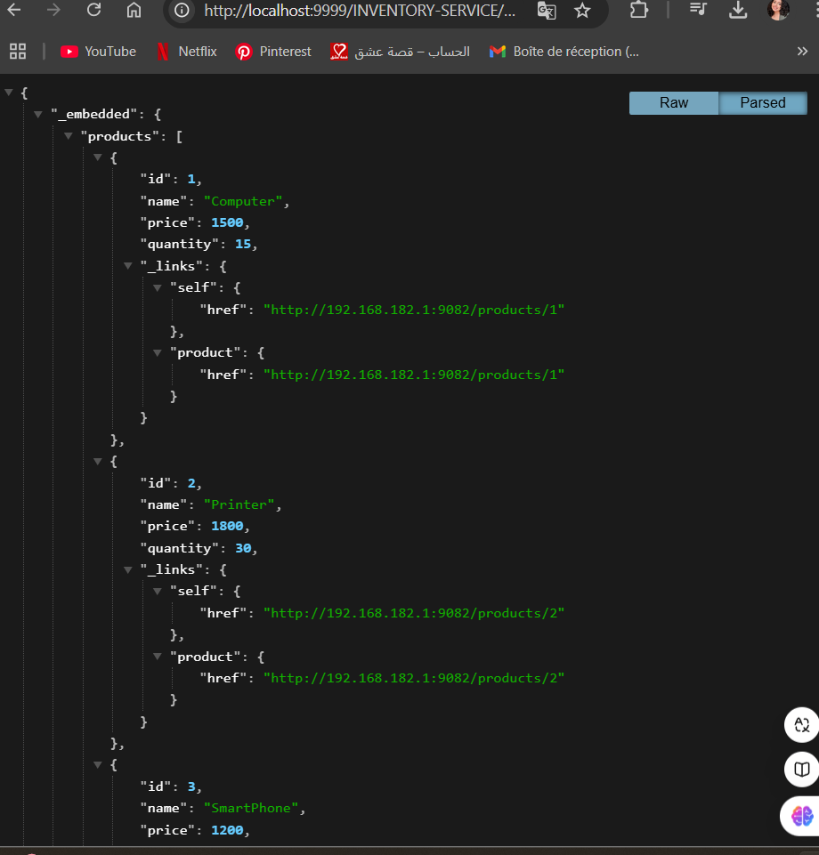
 <h3> Consultation d'un compte</h3>
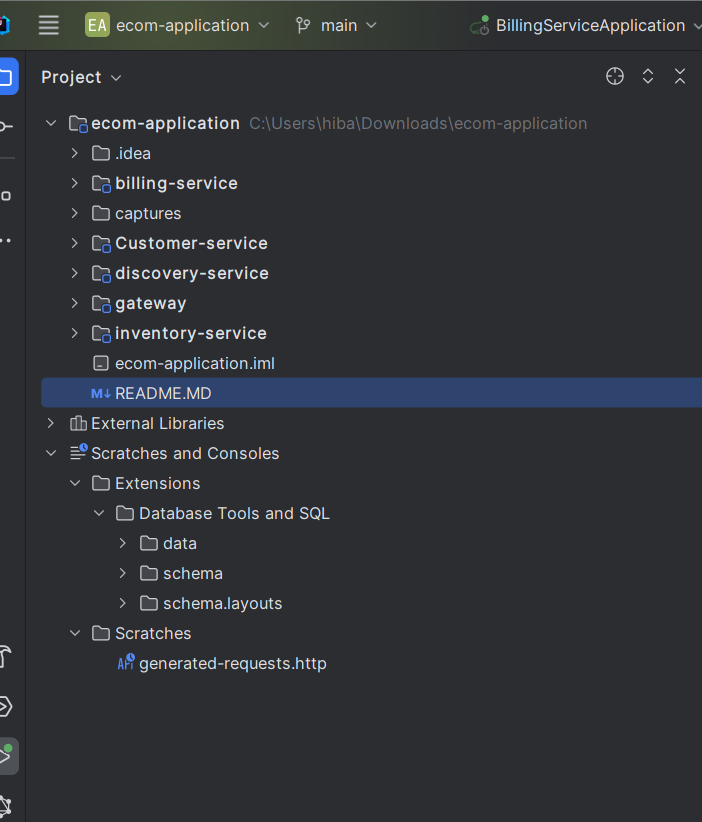
 <h3> Mutation</h3>

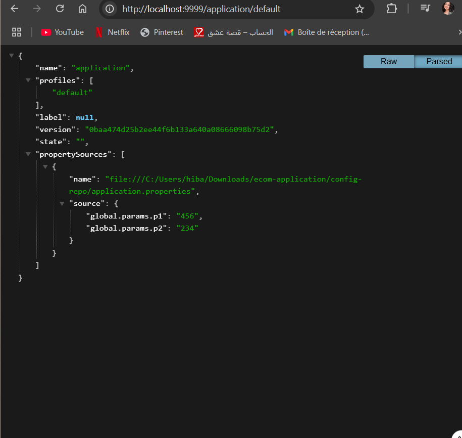
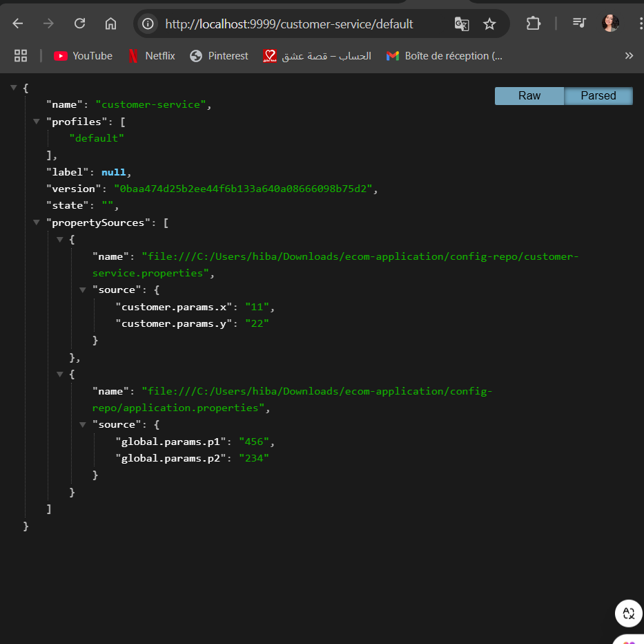
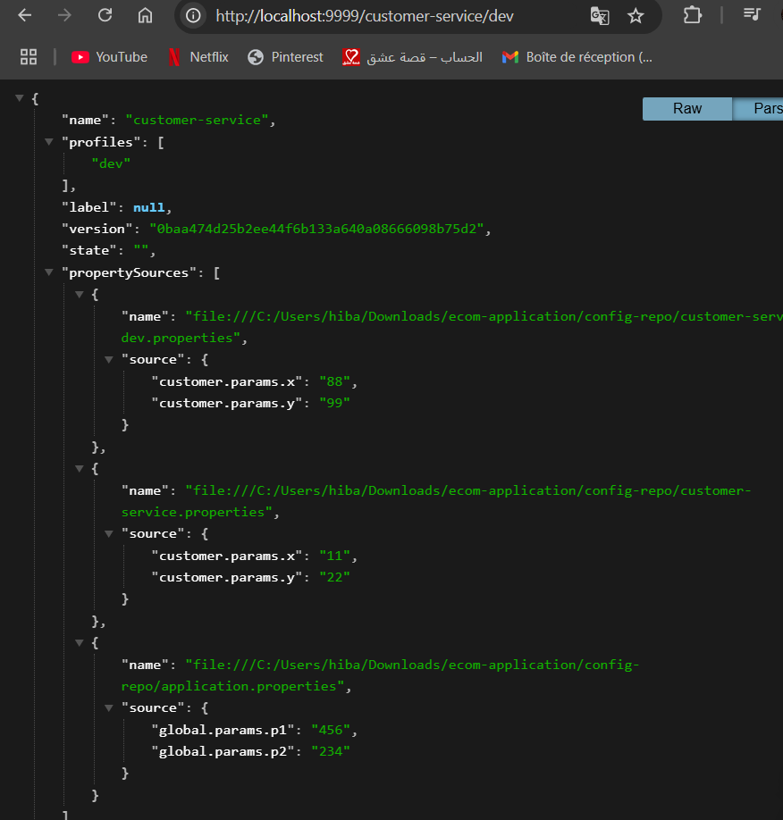
<h3> updateAccount</h3>
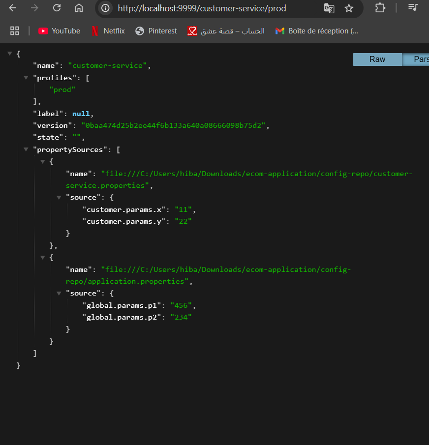
<h3> deleteAccount</h3>
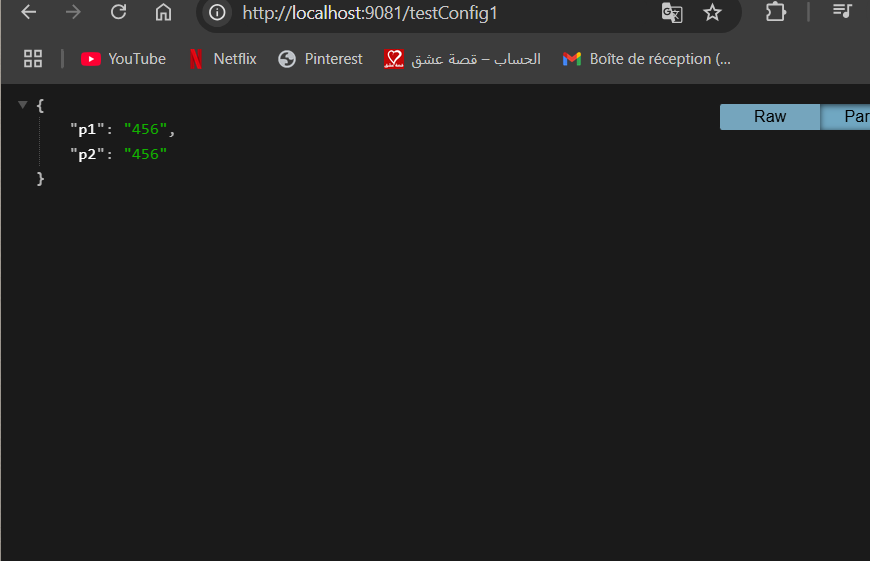
<h3>  Creation des customers</h3>

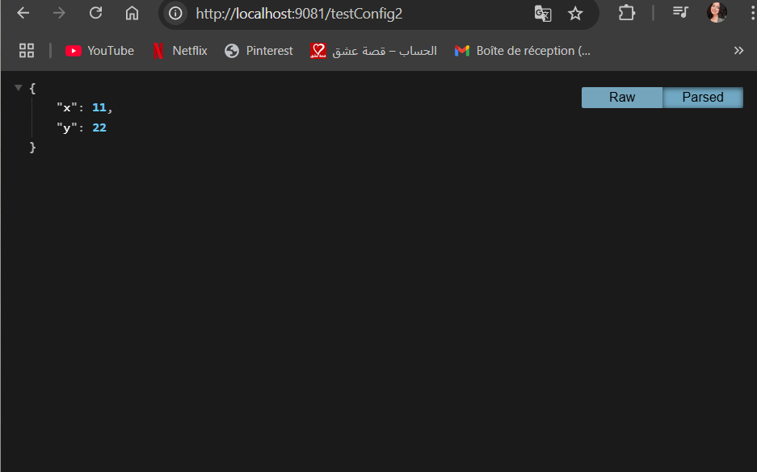

<h3> ❤❤❤❤❤❤❤❤❤❤❤❤❤❤❤❤❤❤❤❤❤❤❤ </h3>

